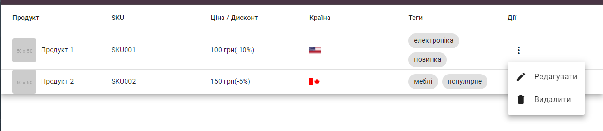
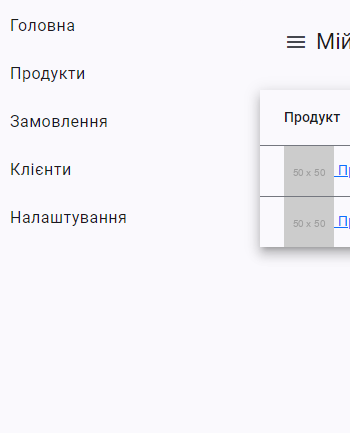
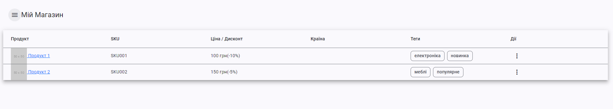
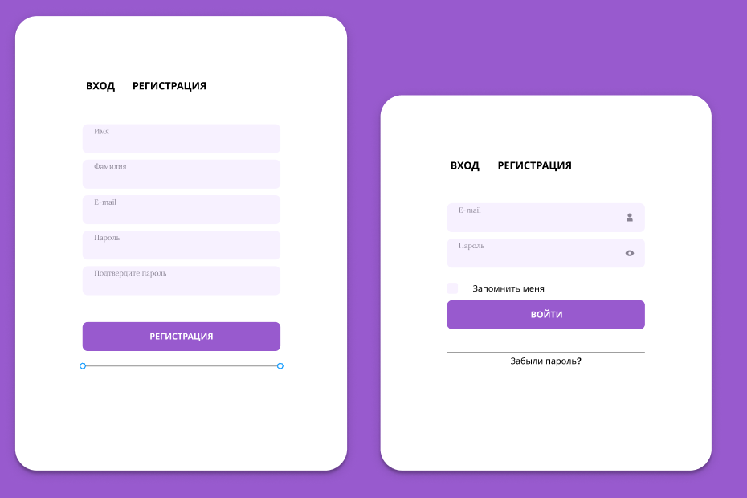

# ### Частина 1
# Завдання: Створити таблицю з продуктами
Для завдання вам потрібно використовувати https://material.angular.io/

Зверніть увагу на версію. матеріал і вашого Angular

#### **Опис завдання:**

1. **Створити таблицю**, яка відображає список продуктів.
2. Кожен рядок таблиці має містити наступні колонки:
    - **Продукт**:
        - Ім'я продукту як **посилання** на сторінку продукту.
        - Зображення продукту (вивести поруч з ім'ям).
    - **SKU**: Унікальний код продукту.
    - **Ціна / Дисконт**: Відобразити ціну зі знижкою або без неї.
    - **Прапор країни**: Відобразити прапор країни походження продукту.
    - **Теги**: Вивести **теги** у вигляді чипсів.
    - **Екшн, Меню**:
        - Додати **кнопку меню** в колонці "Екшн", яка відкриватиме список дій.
        - У меню екшенів передбачити можливість **редагування** та **видалення** продукту.
        - Додати **хінт** (підказку) на кнопки редагування та видалення з текстом: _"В розробці"_.

---

#### **Вимоги до зовнішнього вигляду:**
1. **Всі колонки йдуть компонентавми**
2. **Колонка "Продукт"**:
    - Відображати картинку продукту поруч з ім'ям.
    - Ім'я продукту має бути **посиланням** на сторінку цього продукту.

3. **Колонка "Теги"**:
    - Виводити теги як **чипси** (стилізовані мітки).

4. **Колонка "Екшн, Меню"**:
    - Додати **кнопку меню** для кожного продукту.
    - При кліку на кнопку відкривається **список дій** (наприклад: "Редагувати", "Видалити").
    - На кнопки "Редагувати" та "Видалити" додати хінт: **"В розробці"**.

---

#### **Рекомендації:**

- Використати **Angular Material** або будь-який інший UI-фреймворк для швидкої реалізації (опціонально).
- Забезпечити адаптивний дизайн для коректного відображення на різних екранах.
- Для прапорів країн можна використати іконки (наприклад, із пакету `flag-icons`).
- Для чипсів можна використати компоненти з бібліотеки Angular Material або стилізувати самостійно.
- Додати стилізацію для хінтів при наведенні на екшн-кнопки.

---

#### **Приклад вигляду таблиці:**

---

#### **Приклад меню дій:**
- Редагувати _(хінт: "В розробці")_
- Видалити _(хінт: "В розробці")_
---
# ### Частина 2

### **Завдання: Створення бокового меню та модального вікна для редагування продуктів**
### **Кожна частина повинна бути в окремому модулі/standalone. та компоненті як в таблиці, так і в інших частинах app**

Створювати форми, роутінг, на данний час не потрібно, тільки ознайомитись з material

---

## 1. **Бокове меню (сайдбар)**
### Завдання:
- Реалізувати **бокове меню**, яке відкривається і закривається при натисканні на іконку "меню".
- Angular material
- Додати **пункти меню** для навігації:
   - Головна
   - Продукти
   - Замовлення
   - Клієнти
   - Налаштування
---

### **Приклад розмітки бокового меню**:

- В меню мають бути такі пункти:
   - **Головна**
   - **Продукти**
   - **Замовлення**
   - **Клієнти**
   - **Налаштування**


## 2. **Модальне вікно для редагування продуктів**
### Завдання:
- Реалізувати **модальне вікно** з формою для редагування продукту.
- Використати Angular Material **MatDialog** для створення модального вікна.
- Форма повинна містити поля:
   - Назва продукту
   - Ціна
   - Знижка (%)
   - SKU
   - Типи(chips)
   - країна
- При натисканні **"Зберегти"** хінт "в розробці".
- При натисканні **"Скасувати"** діалог має закриватися без змін.
---





# ### Частина 3


### **Умови завдання**

1. **Реалізувати принцип CRUD для продуктів**  
   CRUD (Create, Read, Update, Delete) — це набір операцій для роботи з даними:
    - **Create (Створення):** Додавання нового продукту.
    - **Read (Читання):** Отримання списку всіх продуктів.
    - **Update (Оновлення):** Зміна даних продукту.
    - **Delete (Видалення):** Видалення продукту зі списку.

2. **Таблиця продуктів із кнопками керування**
    - Продукти повинні відображатися у вигляді таблиці.
    - Для кожного продукту повинні бути доступні кнопки:
        - **Змінити:** Відкриває форму для редагування полів продукту.
        - **Видалити:** Видаляє продукт після підтвердження.

3. **Додати кнопку "Додати продукт" над таблицею**
    - Кнопка **"Додати продукт"** відкриває форму для введення даних нового продукту.
    - Після додавання новий продукт має з’явитися у таблиці без перезавантаження сторінки.
4. **Після додавання/оновлення продукту. потрібне оновлення таблиці**

---

### server

````markdown
# Products API Server

## Описание

Сервер для управления продуктами с поддержкой загрузки изображений.

## Установка

1. Установите зависимости:
   ```bash
   npm install
   ```
````

2.
3. Запустите сервер:
   ```bash
   node index.js
   ```

## Маршруты

### 1. Получить случайный продукт

`GET /random-product`  
**Ответ:**

```json
{
  "productID": 1,
  "name": "Продукт 1",
  "price": 100,
  "discount": 10,
  "sku": "SKU001",
  "isActive": true,
  "countryCode": "us",
  "tags": ["электроника", "новинка"],
  "imageUrl": "/uploads/1698068457112-123.jpg"
}
```

### 2. Получить все продукты

`GET /all-products`  
**Ответ:**

```json
[
  {
    "productID": 1,
    "name": "Продукт 1",
    "price": 100,
    "discount": 10,
    "sku": "SKU001",
    "isActive": true,
    "countryCode": "us",
    "tags": ["электроника", "новинка"],
    "imageUrl": "/uploads/1698068457112-123.jpg"
  }
]
```

### 3. Добавить продукт с изображением

`POST /products`  
**Тело запроса:**  
Форма следующими полями:

```json
{
  "name": "Новый продукт",
  "price": "200",
  "discount": "10",
  "sku": "SKU021",
  "isActive": "true",
  "countryCode": "us",
  "itemUrl": "https://example.com/new-product",
  "tags": "электроника,новинка"
}
```

**Ответ:**

```json
{
  "productID": 2,
  "name": "Новый продукт",
  "price": 200,
  "imageUrl": "/uploads/1698068457112-456.jpg"
}
```

### 4. Обновить продукт

`PUT /products/:id`  
**Тело запроса:**

```json
{
  "price": 150,
  "isActive": false
}
```

### 5. Удалить продукт

`DELETE /products/:id`

---

## Запуск сервера

Сервер доступен на порту `80`.  
После загрузки изображений они будут доступны по URL:

### **Интерфейсы продуктов**
```
export interface Product {
  productID: number;
  name: string;
  price: number;
  discount: number;
  sku: string;
  isActive: boolean;
  countryCode: string;
  itemUrl: string;
  tags: string[];
  imageUrl: string;
}
````
# ### Частина 4

# Покращення таблиці продуктів та модального вікна редагування

## Опис завдання

У цьому проєкті необхідно:

1. **Додати нову колонку** з категоріями в таблицю продуктів.
2. Оскільки продукт може мати багато категорій, у таблиці потрібно відображати **тільки першу та останню** категорію.
3. Реалізувати **модальне вікно редагування продукту** з двома **табами**:
    - **Таб 1:** Редагування основних параметрів (назва, ціна, знижка).
    - **Таб 2:** Відображення категорій у вигляді **дерева**.
4. **Функціонал додавання нових категорій** буде реалізовано пізніше.

---

## Вимоги

### 1. **Покращення таблиці продуктів**
- Додайте нову колонку **"Категорії"** у таблицю.
- Якщо категорій кілька, відобразіть **першу та останню** категорію у форматі:
  ```  
  Перша категорія > ... > Остання категорія  
  ```
- Якщо категорія одна — відобразіть тільки її.
- При натисканні на рядок таблиці має відкриватися **модальне вікно редагування продукту**.
  
---

### 2. **Модальне вікно редагування продукту**
- Реалізуйте модальне вікно з **двома табами**:
    1. **Основні параметри** (назва, ціна, знижка).
    2. **Категорії**: Відображення категорій продукту у вигляді **дерева**.
- **Функціонал додавання категорій** буде впроваджено у майбутньому.
  
---


## План роботи

1. **Оновити таблицю продуктів**:
    - Додати колонку для категорій.
    - Реалізувати логіку для показу лише першої та останньої категорій.

2. **Реалізувати модальне вікно редагування**:
    - Додати таби для основних параметрів та категорій.
    - Побудувати дерево категорій для відображення в табі "Категорії".

---
# ### Частина 5

# Завдання: Реалізація таблиці, модального вікна та компонентів входу/реєстрації

## Вимоги до реалізації

### 1. Динамічна таблиця з продуктами
- Використати компонент для відображення **списку продуктів** у вигляді таблиці.

---

### 2. Модальне вікно з реактивною формою
- Використати **Reactive Forms** для редагування продукту.
- Форма повинна містити такі поля:
    - **Назва продукту** (обов’язкове поле, `required`)
    - **Ціна** (позитивне число, `min` > 0)
    - **Знижка** (позитивне число, `min` > 0)
    - **CKU** код
- Використати вбудовані та **кастомні валідатори** для перевірки даних.

---

### 3. Компонент входу (Login)
- Реалізувати окремий компонент для **входу користувача**.
- Форма входу має містити:
    - **Email** (обов'язкове, формат email)
    - **Пароль** (обов'язкове, `minLength: 6`)
- Додати кнопку "Увійти" та перевірку коректності введених даних.
- У разі помилки показувати відповідне повідомлення.

---

### 4. Компонент реєстрації (Registration)
- Реалізувати окремий компонент для **реєстрації нового користувача**.
- Форма реєстрації має містити:
    - **Ім'я користувача** (обов'язкове)
    - **Email** (обов'язкове, формат email)
    - **Пароль** (обов'язкове, `minLength: 6`)
    - **Підтвердження пароля** (перевірка на збіг з паролем)
- Використати реактивні форми та **кастомні валідатори** для перевірки полів.
- Додати асинхронний валідатор для перевірки унікальності email.

---

## Додаткові вимоги
- Використати Angular Material або Bootstrap для стилізації компонентів.
- Використати **FormGroup** та **FormControl** для керування полями форм.
- Намагайтесь зробити щось схоже на реальний UI/IX, напишіть стилі до компонентів
---
