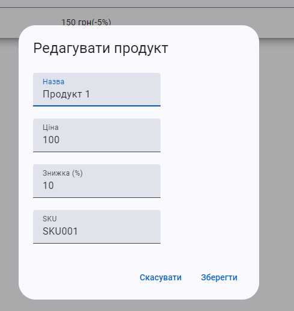

# ### Частина 1
# Завдання: Створити таблицю з продуктами
Для завдання вам потрібно використовувати https://material.angular.io/

Зверніть увагу на версію. матеріал і вашого Angular

#### **Опис завдання:**

1. **Створити таблицю**, яка відображає список продуктів.
2. Кожен рядок таблиці має містити наступні колонки:
    - **Продукт**:
        - Ім'я продукту як **посилання** на сторінку продукту.
        - Зображення продукту (вивести поруч з ім'ям).
    - **SKU**: Унікальний код продукту.
    - **Ціна / Дисконт**: Відобразити ціну зі знижкою або без неї.
    - **Прапор країни**: Відобразити прапор країни походження продукту.
    - **Теги**: Вивести **теги** у вигляді чипсів.
    - **Екшн, Меню**:
        - Додати **кнопку меню** в колонці "Екшн", яка відкриватиме список дій.
        - У меню екшенів передбачити можливість **редагування** та **видалення** продукту.
        - Додати **хінт** (підказку) на кнопки редагування та видалення з текстом: _"В розробці"_.

---

#### **Вимоги до зовнішнього вигляду:**
1. **Всі колонки йдуть компонентавми**
2. **Колонка "Продукт"**:
    - Відображати картинку продукту поруч з ім'ям.
    - Ім'я продукту має бути **посиланням** на сторінку цього продукту.

3. **Колонка "Теги"**:
    - Виводити теги як **чипси** (стилізовані мітки).

4. **Колонка "Екшн, Меню"**:
    - Додати **кнопку меню** для кожного продукту.
    - При кліку на кнопку відкривається **список дій** (наприклад: "Редагувати", "Видалити").
    - На кнопки "Редагувати" та "Видалити" додати хінт: **"В розробці"**.

---

#### **Рекомендації:**

- Використати **Angular Material** або будь-який інший UI-фреймворк для швидкої реалізації (опціонально).
- Забезпечити адаптивний дизайн для коректного відображення на різних екранах.
- Для прапорів країн можна використати іконки (наприклад, із пакету `flag-icons`).
- Для чипсів можна використати компоненти з бібліотеки Angular Material або стилізувати самостійно.
- Додати стилізацію для хінтів при наведенні на екшн-кнопки.

---

#### **Приклад вигляду таблиці:**

---

#### **Приклад меню дій:**
- Редагувати _(хінт: "В розробці")_
- Видалити _(хінт: "В розробці")_
---
# ### Частина 2

### **Завдання: Створення бокового меню та модального вікна для редагування продуктів**
### **Кожна частина повинна бути в окремому модулі/standalone. та компоненті як в таблиці, так і в інших частинах app**

---

## 1. **Бокове меню (сайдбар)**
### Завдання:
- Реалізувати **бокове меню**, яке відкривається і закривається при натисканні на іконку "меню".
- Angular material
- Додати **пункти меню** для навігації:
   - Головна
   - Продукти
   - Замовлення
   - Клієнти
   - Налаштування
---

### **Приклад розмітки бокового меню**:

- В меню мають бути такі пункти:
   - **Головна**
   - **Продукти**
   - **Замовлення**
   - **Клієнти**
   - **Налаштування**

## 2. **Модальне вікно для редагування продуктів**
### Завдання:
- Реалізувати **модальне вікно** з формою для редагування продукту.
- Використати Angular Material **MatDialog** для створення модального вікна.
- Форма повинна містити поля:
   - Назва продукту
   - Ціна
   - Знижка (%)
   - SKU
   - Типи(chips)
   - країна
- При натисканні **"Зберегти"** хінт "в розробці".
- При натисканні **"Скасувати"** діалог має закриватися без змін.
---

